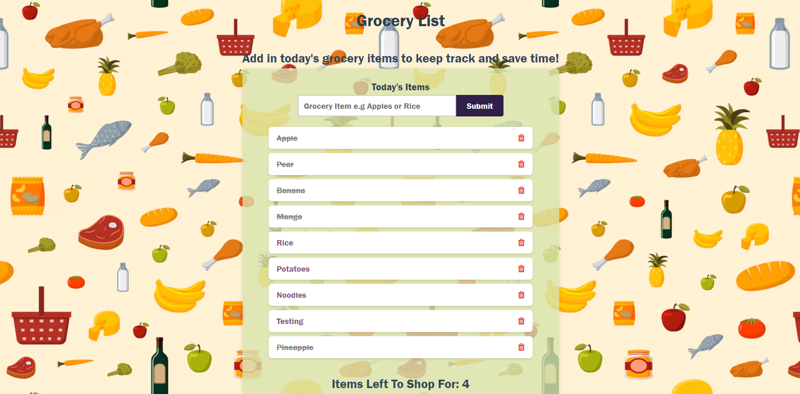

# Grocery List

# About this project
Add items to your grocery list, cross them off when complete or delete. Counter for how many you have left.

### View my project here: 

##### Installation

1. Clone repo
2. run `npm install`

##### Usage

1. run `node server.js`
2. Navigate to `localhost:3000`

## How It's Made:
Tech used: 
- JavaScript
- Node.js. 
- Express.js
- EJS
- MongoDB
- HTML & CSS

This is a full stack grocery list application. When you mark an grocery item it grays out and has a strike-through, it also updates in the database as complete or incomplete as true/false.

## Lessons Learned:
I learned how to create my own database on MongoDB. I created a small api and learned how to communicate from front to backend dataflows.
## Backend Technologies
MongoDB Atlas: https://www.mongodb.com/atlas/database